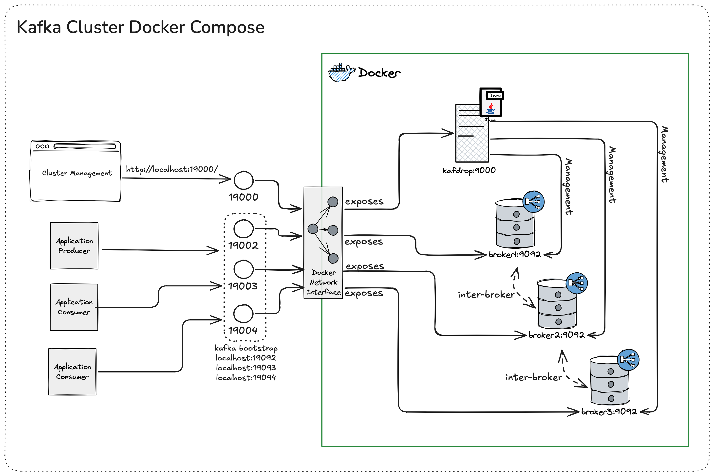

# Kafka Cluster Docker Compose Setup


## Overview
This setup provides a Kafka cluster using KRaft mode (ZooKeeper-free) with 3 brokers. Each broker is configured as both a broker and a controller, using plaintext communication and supporting automatic topic replication.



## File Structure

The following is an overview of the key files and directories in this repository:

```
.
├── docker-compose.yml
├── scripts/
├── docs/
│   ├── docker-compose-stack.png
│   ├── docker-compose-stack.json
│   └── kafdrop.png
├── .env.example
└── LICENSE.md
```

- **docker-compose.yml**: Defines the services, networks, and volumes for the Kafka cluster setup.
- **scripts/**: Contains scripts used for initializing and managing the Kafka brokers.
- **docs/**: Contains documentation and images related to the project, such as diagrams and UI screenshots.
  - **docker-compose-stack.png**: An image file depicting the Docker Compose stack.
  - **docker-compose-stack.json**: A JSON file for editing the Docker Compose stack diagram in Excalidraw.
  - **kafdrop.png**: An image file related to Kafdrop, possibly a diagram or screenshot.
- **.env.example**: Template for environment variables, including the `KAFKA_CLUSTER_ID`.
- **LICENSE.md**: Contains the MIT License for the project.

## Checking Out the Repository
To clone the repository, use the following command:
```bash
git clone git@github.com:luismr/kafka-cluster-docker-compose.git
```

## Setting Up the Network
Before starting the Kafka cluster, ensure the `kafka-net` network is created. You can create it manually with:
```bash
docker network create kafka-net
```

## Setting the KAFKA_CLUSTER_ID

The `KAFKA_CLUSTER_ID` is a crucial environment variable for setting up the Kafka cluster in KRaft mode. You can set this variable in two ways:

### Using an .env File
1. Rename the `.env.example` file to `.env`.
2. Open the `.env` file and set the `KAFKA_CLUSTER_ID` variable:
   ```
   KAFKA_CLUSTER_ID=your-unique-cluster-id
   ```
3. Save the file. Docker Compose will automatically load this file and use the variable when starting the containers.

### Setting Environment Variables Directly
Alternatively, you can set the `KAFKA_CLUSTER_ID` as an environment variable in your operating system:

#### On Windows
```cmd
set KAFKA_CLUSTER_ID=your-unique-cluster-id
```

#### On Linux/Mac
```bash
export KAFKA_CLUSTER_ID=your-unique-cluster-id
```

After setting the environment variable, you can start the Kafka cluster with Docker Compose:
```bash
docker-compose up -d
```

## Configuration
- **KAFKA_KRAFT_CLUSTER_ID**: Unique identifier for the Kafka cluster.
- **KAFKA_NODE_ID**: Unique ID for each broker.
- **KAFKA_PROCESS_ROLES**: Configures the broker to act as both a broker and a controller.
- **KAFKA_LISTENERS**: Defines the internal and external listeners for each broker.
- **KAFKA_LISTENER_SECURITY_PROTOCOL_MAP**: Specifies the security protocol for each listener (plaintext).
- **KAFKA_INTER_BROKER_LISTENER_NAME**: Specifies the listener used for inter-broker communication.
- **KAFKA_CONTROLLER_LISTENER_NAMES**: Specifies the listener used for controller communication.
- **KAFKA_ADVERTISED_LISTENERS**: Advertises the listener addresses for client connections.
- **KAFKA_LOG_DIRS**: Directory where Kafka logs are stored.
- **KAFKA_OFFSETS_TOPIC_REPLICATION_FACTOR**: Sets the replication factor for the offsets topic.
- **KAFKA_TRANSACTION_STATE_LOG_REPLICATION_FACTOR**: Sets the replication factor for the transaction state log.
- **KAFKA_TRANSACTION_STATE_LOG_MIN_ISR**: Minimum in-sync replicas for the transaction state log.

## Running the Kafka Cluster
To start the Kafka cluster, use the following command:
```bash
docker-compose up -d
```
This command will start all the services defined in the `docker-compose.yml` file in detached mode.

## Connecting to the Kafka Cluster

You can connect to the Kafka cluster using various client libraries. Below is an example using Python with the `kafka-python` library.

### Python Example

First, install the `kafka-python` library:

```bash
pip install kafka-python
```

Then, use the following script to produce and consume messages:

```python
from kafka import KafkaProducer, KafkaConsumer

# Producer
producer = KafkaProducer(bootstrap_servers=['localhost:19092', 'localhost:19093', 'localhost:19094'])
producer.send('my-topic', b'Hello, Kafka!')
producer.flush()

# Consumer
consumer = KafkaConsumer('my-topic', bootstrap_servers=['localhost:19092', 'localhost:19093', 'localhost:19094'])
for message in consumer:
    print(f"Received message: {message.value.decode('utf-8')}")
```

This example connects to the Kafka brokers running on `localhost:19092`, `localhost:19093`, and `localhost:19094`.

## Running Kafka in Standalone

Running Kafka in standalone mode is important for testing and development purposes. It allows you to quickly set up a Kafka broker without the need for a full cluster, making it easier to test configurations, produce and consume messages, and develop applications locally.

To run Kafka in standalone mode, use the following command:

```bash
docker run -d \
  --name broker \
  -p 9092:9092 \
  apache/kafka:latest
```

## License

This project is licensed under the MIT License. For more details, please refer to the [LICENSE.md](LICENSE.md) file.

